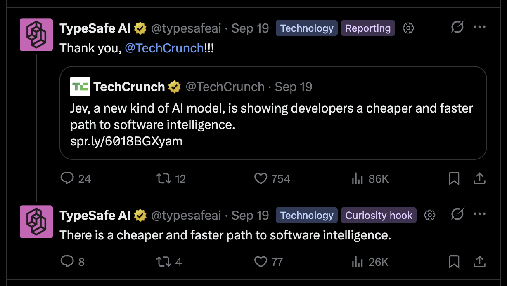
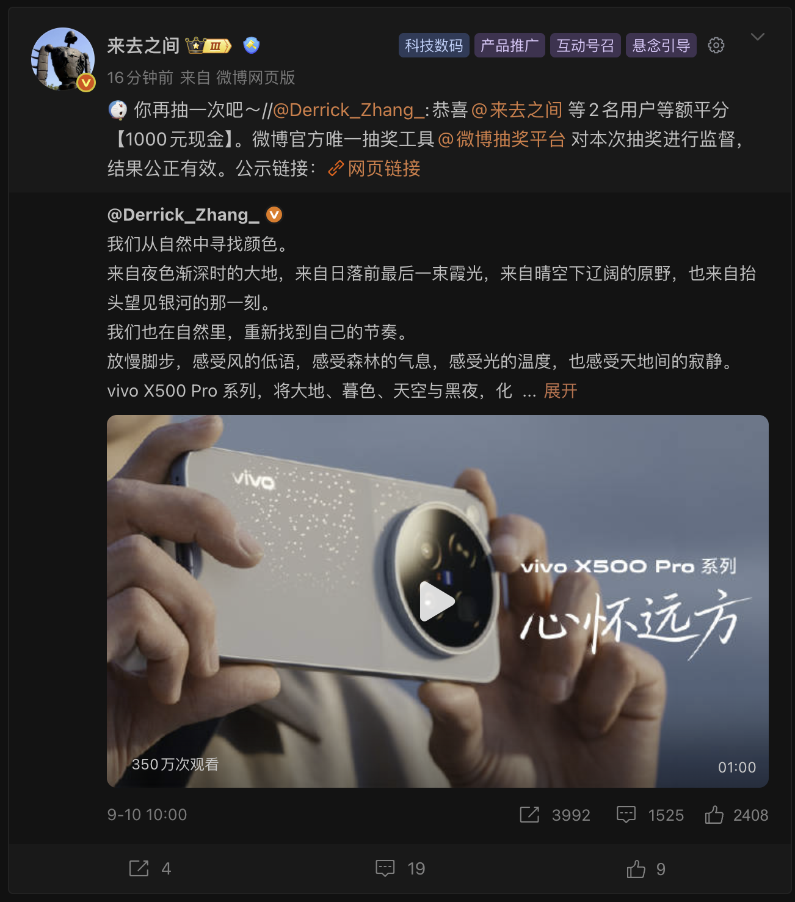

<div align="center">
  
  <h1>Feed Lens</h1>
  <p>Your labels. Your perspective on the feed.</p>
  <p><strong>English</strong> · <a href="README.zh-CN.md">简体中文</a></p>
  <p><a href="https://github.com/SkywalkerDarren/feed-lens/releases">Download</a> · <a href="#quick-start">Quick start</a> · <a href="https://darrenis.top/products/feed-lens/privacy/?lang=en">Privacy</a> · <a href="https://github.com/SkywalkerDarren/feed-lens/issues">Feedback</a></p>
</div>

Feed Lens is an open-source Chrome extension that adds customizable text labels to **Weibo, Threads and X**. See what a post is about and how it communicates, using your own label definitions and TypeSafe API key.



*X — content topics and expression styles at a glance.*



*Weibo — multiple labels displayed beside the author.*

## Features

- **Two perspectives:** organize labels into content topics and expression styles.
- **Independent platforms:** each platform has its own dictionary and automatic-labeling switch.
- **Compact labels:** show up to four labels beside the author, with `+N` for more. Open the gear for scores, extracted text and retry controls.
- **Your own rules:** edit both the displayed label and the description used for classification.
- **Portable settings:** import and export all platform dictionaries, switches and interface language as JSON. Your API key stays in the browser.
- **Six languages:** English, Simplified Chinese, Japanese, Spanish, Italian and German.

## Quick start

You need **Chrome 114+** and a **TypeSafe account with an API key and available usage allowance**. API usage is billed to your TypeSafe account.

1. Download `feed-lens-<version>.zip` from [Releases](https://github.com/SkywalkerDarren/feed-lens/releases) and unzip it.
2. Open `chrome://extensions`, enable **Developer mode**, then choose **Load unpacked**.
3. Select the extracted folder containing `manifest.json`.
4. Open Feed Lens settings. Choose **API connection**, enter your key and save it.
5. Select Weibo, Threads or X, turn on automatic labeling. The switch takes effect immediately.
6. Refresh the social website to start labeling loaded posts.

New installations start with all platforms paused. The API key is shared across platforms; dictionaries and switches are separate.

**Updating:** replace the files in your existing extension folder, click **Reload** on the extension card, then refresh the social website. Keep the same folder to retain the extension's identity and local settings.

## Customize your labels


Choose a platform in the sidebar, then select **Content topics** or **Expression styles**. Add, search, edit or remove labels and save the current platform. Save applies only to labels. Switching platforms retains unsaved edits; closing or refreshing the settings page prompts before discarding them.

| Field | Purpose | Limit |
| --- | --- | --- |
| Label display | Text shown beside the post author | Required; up to 30 characters |
| Label description | Criteria used to decide whether the label matches | Required; up to 400 characters |
| Dictionary | Labels across both groups | Up to 60 per platform |

For example, use **Hands-on review** as the display text and **Describes the author's direct experience using a product, including observations about its performance or usability** as the description.

Character limits use UTF-16 code units, matching browser input limits. Requests also have a combined size budget; see [label and request limits](docs/label-limits.md).

Changing the interface language preserves saved custom labels. **Restore presets** loads the default labels in the selected language for the current platform.

### Import and export

- **Export** downloads the current dictionaries, switches and language, including valid unsaved label edits.
- **Import** validates a JSON file of up to 1 MiB and shows a summary. Confirming it replaces and saves settings for all three platforms; your API key remains unchanged.
- Both paths validate label names and descriptions. Keep an export before replacing a dictionary you want to reuse.

## Data and processing

Enabled platforms send loaded post text, the platform name and your label rules **directly to TypeSafe**. This can include off-screen preloaded posts, quoted text and non-public posts you can access. Classification uses extracted text, capped at 12,000 characters per post.

Your key and settings are stored locally in `chrome.storage.local`, without Chrome sync. Feed Lens operates no relay server, telemetry or advertising system. See the [privacy notice](https://darrenis.top/products/feed-lens/privacy/?lang=en) for data scope, storage and controls.

The extension detects stable post text as the page loads. Up to eight background tasks run concurrently; matching in-flight requests are merged, and up to 300 recent results are cached in background memory. Temporary service errors retry independently with bounded timeouts. The gear menu shows progress and recovery actions.

## Development

The extension uses Manifest V3 and plain JavaScript. No npm dependencies or compilation step are required. Use **Node.js 22+** and **Python 3.9+**.

```sh
git clone https://github.com/SkywalkerDarren/feed-lens.git
cd feed-lens
npm test
npm run package
```

The package is written to `dist/feed-lens-<version>.zip`, with `manifest.json` at its root. Only runtime files and license notices are included.

| File | Responsibility |
| --- | --- |
| `adapters.js` | Platform-specific post extraction |
| `content.js` | Inline labels, detail panel and dynamic post detection |
| `platforms.js` | Platform settings and legacy Weibo configuration migration |
| `background.js`, `transport.js` | Request validation, scheduling, retries, deduplication and cache |
| `options.*`, `config.js` | Settings workspace and configuration import/export |
| `i18n.js`, `presets.js`, `_locales/` | Interface translations and localized default labels |

Automated tests cover validation, settings isolation and request handling. For platform changes, also check current live pages and record the browser version and reproduction steps. See [Contributing](CONTRIBUTING.md).

## Releases and support

[Releases](https://github.com/SkywalkerDarren/feed-lens/releases) provide the extension ZIP and Chrome Web Store materials. Version 0.4.0 is a **prerelease**; Chrome Web Store submission is pending.

Report reproducible bugs in [Issues](https://github.com/SkywalkerDarren/feed-lens/issues). For privacy or security matters, contact [contact@darrenis.top](mailto:contact@darrenis.top); see [Security](SECURITY.md).

Licensed under [Apache-2.0](LICENSE). Feed Lens is an independent project, unaffiliated with the supported social platforms, Google or TypeSafe.
