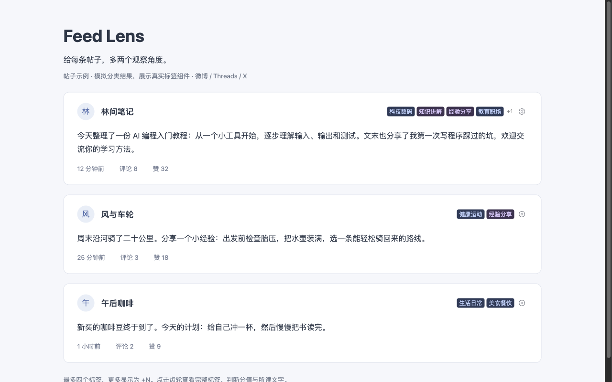
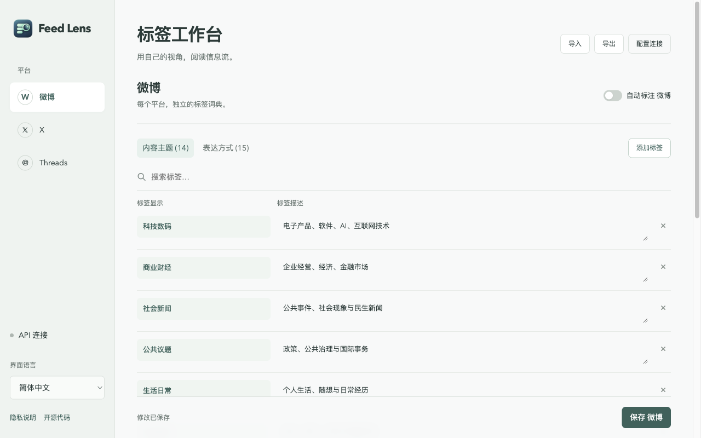

<div align="center">
  
  <h1>Feed Lens</h1>
  <p>用自己的标签，从自己的视角阅读信息流。</p>
  <p><a href="README.md">English</a> · <strong>简体中文</strong></p>
  <p><a href="https://github.com/SkywalkerDarren/feed-lens/releases">下载</a> · <a href="#快速开始">快速开始</a> · <a href="https://darrenis.top/products/feed-lens/privacy/?lang=zh">隐私说明</a> · <a href="https://github.com/SkywalkerDarren/feed-lens/issues">问题反馈</a></p>
</div>

Feed Lens 是一款开源 Chrome 扩展，为 **微博、Threads 和 X** 的帖子添加自定义文字标签。使用自己的标签定义和 TypeSafe API key，从「讲什么」与「如何表达」两个角度阅读帖子。



*图中使用真实标签组件、合成帖子与模拟分类结果。*

## 功能

- **两个观察角度**：按内容主题与表达方式组织标签。
- **平台独立设置**：微博、Threads 和 X 分别拥有标签词典与自动标注开关。
- **紧凑展示**：作者名字旁最多显示四个标签，多出的用 `+N` 表示；点击齿轮查看分值、所读文字和重试操作。
- **自定义判断标准**：分别编辑标签显示文字与用于分类的标签描述。
- **配置导入导出**：用 JSON 保存所有平台的标签、开关和界面语言，API Key 留在本机。
- **六种语言**：简体中文、英语、日语、西班牙语、意大利语和德语。

## 快速开始

需要 **Chrome 114+**，以及拥有 **API key 和可用额度的 TypeSafe 账户**。API 调用费用由你的 TypeSafe 账户承担。

1. 从 [Releases](https://github.com/SkywalkerDarren/feed-lens/releases) 下载 `feed-lens-<版本号>.zip` 并解压。
2. 打开 `chrome://extensions`，开启 **开发者模式**，点击 **加载已解压的扩展程序**。
3. 选择解压后包含 `manifest.json` 的文件夹。
4. 打开 Feed Lens 设置，进入 **API 连接**，填入并保存 Key。
5. 选择微博、Threads 或 X，开启自动标注并保存当前平台。
6. 刷新社交网站，开始为已加载的帖子添加标签。

首次安装时所有平台默认暂停。API Key 共用，标签词典与开关分别保存。

**更新版本**：将新文件覆盖到原扩展文件夹，在扩展管理页点击 **重新加载**，再刷新社交网站。保留原文件夹路径，以维持扩展身份和本机设置。

## 自定义标签



在侧栏选择平台，然后切换 **内容主题** 或 **表达方式**。添加、搜索、修改或删除标签后，保存当前平台。设置页保持打开时，切换平台会保留尚未保存的编辑。

| 字段 | 用途 | 约束 |
| --- | --- | --- |
| 标签显示 | 帖子作者名字旁展示的文字 | 必填，最多 30 字符 |
| 标签描述 | 判断帖子是否符合该标签的标准 | 必填，最多 400 字符 |
| 标签词典 | 两组标签的总数 | 每个平台最多 60 个 |

例如，标签显示填写 **实际体验**，标签描述填写 **作者描述亲自使用某款产品的经历，并给出性能或易用性方面的具体观察**。

字符限制按 UTF-16 代码单元计算，与浏览器输入框一致。请求还受总容量约束，详见 [标签与请求限制](docs/label-limits.md)。

切换界面语言会保留已保存的自定义标签。点击 **恢复预置**，可为当前平台加载所选语言的默认标签。

### 导入与导出

- **导出**：下载当前所有平台的标签、开关和语言，包括通过校验的未保存标签编辑。
- **导入**：校验不超过 1 MiB 的 JSON 文件并显示摘要；确认后替换并保存三个平台的配置，API Key 保持不变。
- 导入与导出都会校验标签显示和描述。替换词典前，可先导出一份供以后使用。

## 数据与处理方式

启用平台后，已加载的帖子文字、平台名称及标签规则会 **直接发送至 TypeSafe**。这可能包括屏幕外预加载的帖子、引用文字，以及你有权查看的非公开帖子。分类使用提取到的正文，单条最多 12,000 字符。

Key 和设置保存在本机 `chrome.storage.local`，不通过 Chrome 同步。Feed Lens 没有自建中转服务器、遥测或广告系统。数据范围、存储与控制方式详见 [隐私说明](https://darrenis.top/products/feed-lens/privacy/?lang=zh)。

扩展在页面加载过程中检测稳定的帖子文字，后台最多并发处理八个任务；相同的进行中请求会合并，最近至多 300 条结果缓存在后台内存。临时服务错误独立重试，并设有超时限制。齿轮菜单提供进度和恢复操作。

## 开发

项目使用 Manifest V3 和原生 JavaScript，无需安装 npm 依赖或执行编译。开发环境为 **Node.js 22+**、**Python 3.9+**。

```sh
git clone https://github.com/SkywalkerDarren/feed-lens.git
cd feed-lens
npm test
npm run package
```

安装包输出至 `dist/feed-lens-<版本号>.zip`，`manifest.json` 位于 ZIP 根目录。包内仅包含运行文件和许可证声明。

| 文件 | 职责 |
| --- | --- |
| `adapters.js` | 各平台帖子正文提取 |
| `content.js` | 行内标签、详情面板与动态帖子检测 |
| `platforms.js` | 平台独立设置与旧版微博配置迁移 |
| `background.js`、`transport.js` | 请求校验、调度、重试、去重与缓存 |
| `options.*`、`config.js` | 设置工作台与配置导入导出 |
| `i18n.js`、`presets.js`、`_locales/` | 界面翻译与多语言预置标签 |

自动化测试覆盖输入校验、平台设置隔离和请求处理。修改平台适配时，还应检查当前线上页面，并记录浏览器版本和复现步骤。参见 [贡献指南](CONTRIBUTING.md)。

## 发布与支持

[Releases](https://github.com/SkywalkerDarren/feed-lens/releases) 提供扩展 ZIP 和 Chrome 商店素材。0.4.0 为 **预发布版本**，Chrome 商店尚待提交。

可在 [Issues](https://github.com/SkywalkerDarren/feed-lens/issues) 提交可复现的问题。隐私或安全问题请联系 [contact@darrenis.top](mailto:contact@darrenis.top)，参见 [安全说明](SECURITY.md)。

采用 [Apache-2.0](LICENSE) 许可证。Feed Lens 是独立项目，与所支持的社交平台、Google 及 TypeSafe 无隶属关系。
